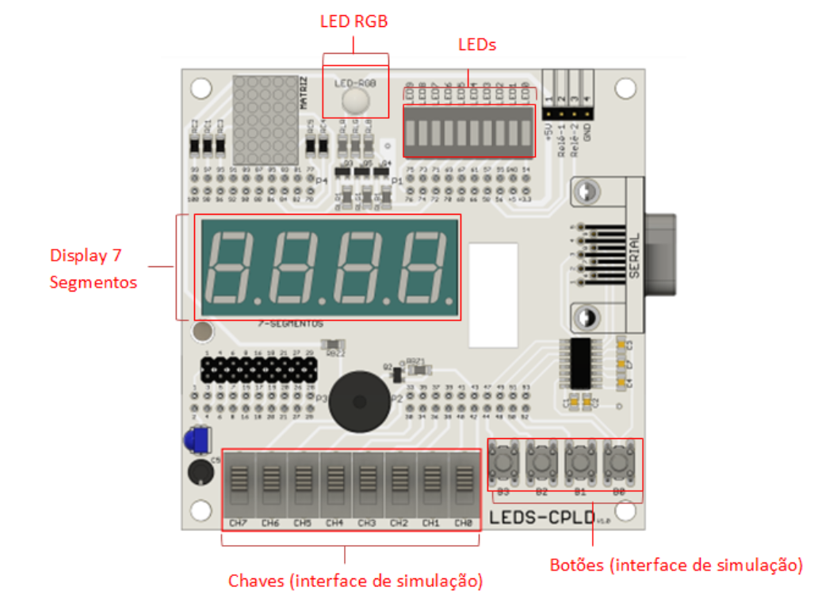

<h1 
    align="center"> 
    🅿️ 
      Gestão Digital de Acesso Veicular
</h1> 

# **Descrição do Projeto**

    O Projeto demandado pelo componente curricular TEC 498 MI - Projeto de Circuito Digitais, utilizando a metodologia
    Problem Based Learning (PBL). Nesse sentido, o sistema foi projetado a partir da linguagem de descrição verilog, 
    possuindo o intuito de simular o sistema para gestão de acesso veicular. Essa simulação acontecerá no Kit LEDS-CPLD,
    utilizando, principalmente, os conceitos e conteúdos referentes à máquina de estado.
    
# **Funcionalidades atendidas no projeto**

    a) No estado inicial, o sistema deve perceber quando um veículo se aproxima, e então solicitar um código de acesso;
    b) Se o código estiver correto, o acesso é liberado através da abertura de uma cancela;
    c) Quando o sistema perceber que o veículo autorizado já entrou no estacionamento, a cancela é fechada e o sistema volta
    ao estado inicial.
    d) Se o código de acesso for incorreto, o sistema permanecerá solicitando a inserção do código até que o código correto 
    seja inserido.
    e) Se o usuário passar mais do que 20s sem inserir um novo código, o sistema deve voltar ao estado inicial.
    f) Se um veículo se aproximar da entrada do estacionamento enquanto outro veículo estiver entrando, um alerta é exibido 
    solicitando que o novo veículo pare e insira um código de acesso.
    g) Se todas as vagas do estacionamento estiverem ocupadas, o sistema entra em estado de bloqueio, sendo liberado quando 
    alguma vaga estiver disponível.

# **Requisitos de Projeto**

    1. Um sensor (chave ou botão) na área externa do estacionamento, próximo da cancela, indica a aproximação do veículo;
    2. Um sensor (chave ou botão) na área interna do estacionamento, próximo da cancela, indica a entrada do veículo;
    3. Um LED deverá indicar se a cancela está aberta ou fechada;
    4. O circuito deverá ter um display que informe ao usuário, de forma amigável, os estados de “entrada liberada”,
    “erro de código”, “pare”;
    5. Um LED verde aceso deve indicar “entrada liberada”;
    6. Um LED vermelho aceso deve indicar “erro de código”;
    7. Um LED azul piscando deve indicar “pare”;
    8. O código de acesso é composto por quatro dígitos inseridos utilizando botões;
    9. Um erro de código é identificado e exibido imediatamente após o dígito incorreto for inserido;
    10. O circuito deverá ter um display que informe ao usuário, de forma amigável, que o estacionamento está cheio, quando for o caso.

# **Diagrama da maquina de Estado**

    Nesse projeto, necessitou-se elaborar três diagramas referentes a cada uma das máquinas.Abaixo será exposto um único diagrama geral
    e legendado comportando as três máquinas criadas, juntamente a uma tabela de identificação.
 

# **Demonstração da Aplicação**

    A interface de simulação é feita através do uso das chaves e botões presentes no kit LEDS-CPLD. Em relação aos sinais de 
    saída referentes a cada situação, por sua vez, serão exibidos através do display de 7 segmentos, LED RGB e nos LEDs, também presentes na placa.

 

    situação de um veículo se aproximar enquanto o outro ainda está passando pela cancela.

     situação de estacionamento cheio, mesmo com veículo detectado pelo sensor externo.

    situação de erro ao digitar a senha.

    situação de estacionamento cheio.

# **Tecnologias utilizadas**

    • Kit de desenvolvimento LEDS-CPLD, da família MAX II (modelo EPM240T100C5N);
    • Linguagem de descrição de hardware Verilog;
    • Projeto desenvolvido no ambiente Quartus II.

# **Pessoas Contribuidoras**

    Emanuel Antônio Lima Pereira
    Gabriel Sousa Sampaio
    Thiago Neri dos Santos Almeida

# **Referências**

    https://drive.google.com/file/d/132iacUp84EfLT1h1q_Fk5f3Js5hizhQA/view?usp=sharing

    Ronald J. Tocci, Neal S. Widmer, Gregory L. Moss. “Sistemas digitais : princípios e aplicações”; revisão técnica 
    Renato Giacomini; tradução Jorge Ritter. – 11ª edição – São Paulo : Pearson Prentice Hall, 2011;

    Ivan Valeije Idoeta, Francisco Gabriel Capuano. “Elementos de eletrônica digital”; – 40ª edição – São Paulo:Editora 
    Érica ltda. ,2008.

